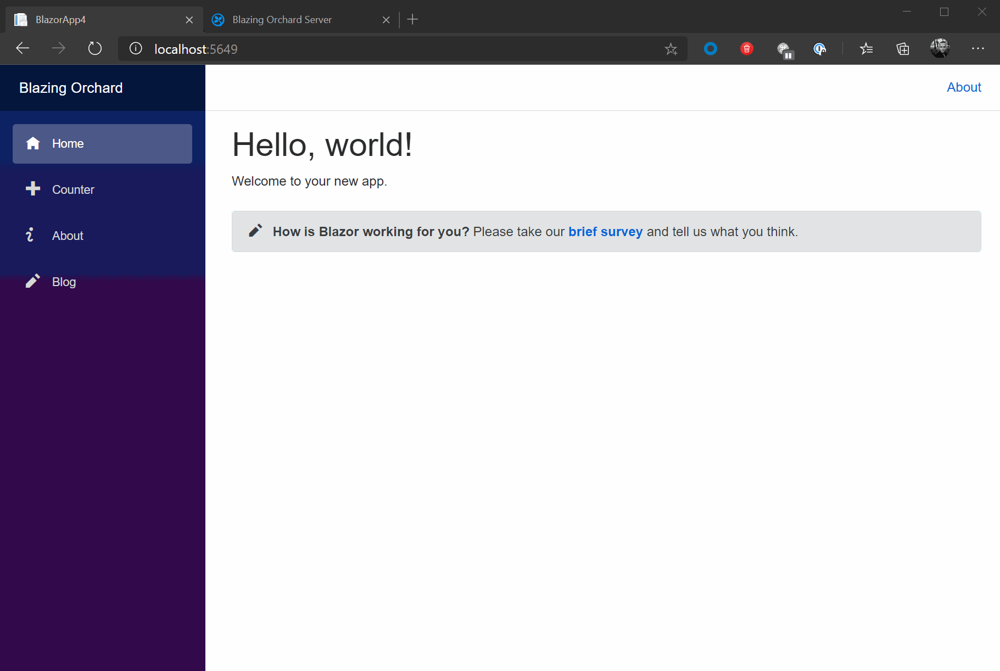

# Blazing Orchard

Blazing Orchard is a modular application framework that turns your [Blazor](https://dotnet.microsoft.com/apps/aspnet/web-apps/blazor) project into a CMS-powered Blazor application by leveraging [Orchard Core](https://github.com/OrchardCMS/OrchardCore/blob/dev/README.md) as a decoupled backend/CMS server using its REST & GraphQL APIs.

## Orchard Core
With Orchard Core, you have a strong, fully customizable backend system straight out of the box that allows you to manage content, workflows, forms, users and more.

## Blazing Orchard
With Blazing Orchard, you build your SPA application as you normally would, but powered by a backend that provides your application with content such as pages, blog posts, site navigation and pretty much anything you want to be content-driven.

## Features

- [x] Navigate to content items managed from Orchard, rendered within Blazor
- [x] Render shapes mapped to components
- [x] Consume APIs from custom Orchard Core modules
- [x] Menu component
- [x] Shape placement / ordering / alternates
- [ ] Search component
- [ ] Shortcode support
- [ ] Embed within an Orchard Core Theme and initialize the Blazor app without explicitly specifying the host URL
- [ ] Offline mode (initialize Blazor using a JSON export of the site)

### Parts
- [x] HtmlBodyPart
- [x] MarkdownPart
- [ ] LiquidPart
- [ ] FlowPart
- [ ] BagPart
- [ ] ListPart
- [ ] TaxonomyPart

### Fields
- [x] TextField
- [x] MarkdownField
- [ ] MediaField
- [ ] TaxonomyField

## Getting Started

Coming soon.
